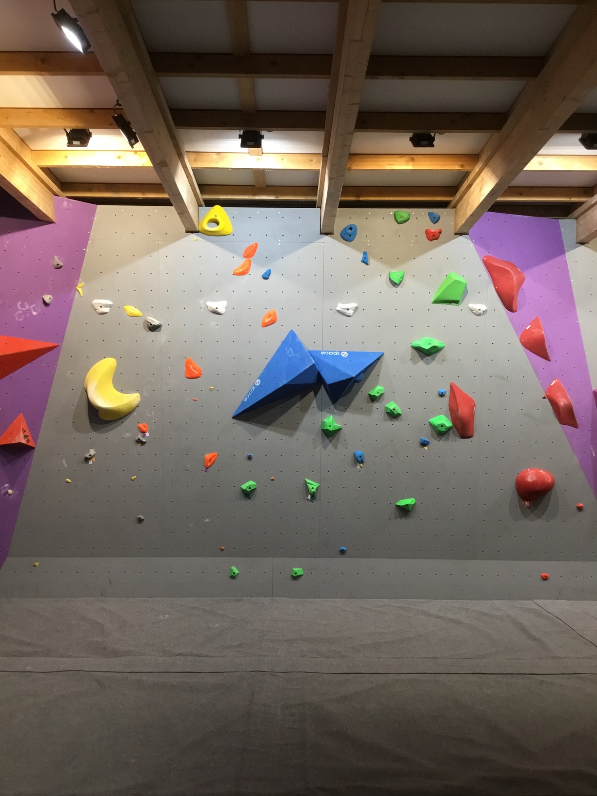
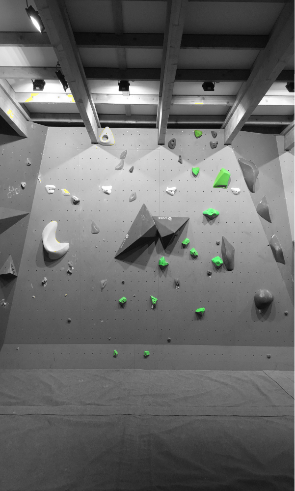
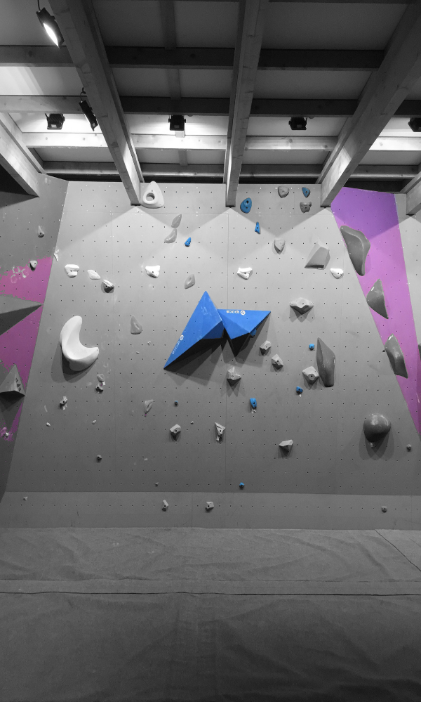

<!-- PROJECT LOGO -->
 

  
  <h3 align="center">Image Color Selector</h3>

  

    Isolate colors from an image in seconds
  

<!-- TABLE OF CONTENTS -->

  
Table of Contents

  <ol>
    <li>
      <a href="#about-the-project">About The Project</a>
      <ul>
        <li><a href="#features">Features</a></li>
        <li><a href="#incomming-features">Incomming Features</a></li>
        <li><a href="#built-with">Built With</a></li>
      </ul>
    </li>
    <li>
      <a href="#getting-started">Getting Started</a>
    </li>
    <li><a href="#usage">Usage</a></li>
    <li><a href="#roadmap">Roadmap</a></li>
    <li><a href="#contributing">Contributing</a></li>
    <li><a href="#license">License</a></li>
    <li><a href="#acknowledgments">Acknowledgments</a></li>
  </ol>

<!-- ABOUT THE PROJECT -->
## About The Project

<!--   -->

    
    
    

This project aims to display just one color and its variations in an image.
From a displayed image you just have to select the wanted color. Then the program willl determine if each color is a variation of the selected one. If not the color will be greyed out.

### Features :
* The image is displayed in a canvas to allow pixel modification
* The algorithm is fast, less than two (2) seconds on average to grey out the non-matching color
* The color selected is displayed so we know what color will be selected

### Incomming Features :
* (WIP) The ability to export the result as another image
* (Incomming) The ability to change the algorithm or the threshold to match a certain wanted result

(<a href="#readme-top">back to top</a>)

### Built With

This project is entirely made in HTML and pure Javascript 

* [![HTML][Html.html]][HTML-url]
* [![Javascript][Javascript.js]][Javascript-url]

(<a href="#readme-top">back to top</a>)

<!-- GETTING STARTED -->
## Getting Started

There is no prerequisite to use this project, simply download the project and open ``index.html``

(<a href="#readme-top">back to top</a>)

### Usage

It is easy to use the programm. Once the image is loaded into the Canvas, by hovering it with the mouse a square will appear at the top right corner of the image. It will show what color is in the crosshair. If the color is good clicking on the image will launch the algorithm to detect the colors matching or parent of the one selected.

For now refreshing the page is the only way to retry the color selection and algorithm.

<!-- ROADMAP -->
## Roadmap

- [x] Choosing a color
- [x] Use an alorithm other than RGB distance
    - [x] CIE76
    - [x] CIE94
    - [ ] CIEDE2000
- [x] Change the algorithm
- [ ] Keep the same Resolution
- [ ] Add Download button
- [ ] Add Change Image
- [ ] Add Retry Button
- [x] Add UI to change the threshold of the detection

(<a href="#readme-top">back to top</a>)

<!-- LICENSE -->
## License

Distributed under the MIT License. See `LICENSE.md` for more information.

(<a href="#readme-top">back to top</a>)

<!-- ACKNOWLEDGMENTS -->
## Acknowledgments

Here are the references used to create this program :

* [CanvasRenderingContext2D](https://developer.mozilla.org/en-US/docs/Web/API/CanvasRenderingContext2D)
* [Color Difference](https://en.wikipedia.org/wiki/Color_difference)
* [CIE76 formula](https://en.wikipedia.org/wiki/Color_difference#CIE76)
* [CIE94 formula (WIP)](https://en.wikipedia.org/wiki/Color_difference#CIE94)
* [CIE00 formula (WIP)](https://en.wikipedia.org/wiki/Color_difference#CIEDE2000)
* [Research paper : The CIEDE2000 Color-Difference Formula: Implementation Notes, Supplementary Test Data, and Mathematical Observations](https://hajim.rochester.edu/ece/sites/gsharma/ciede2000/ciede2000noteCRNA.pdf)
* [Easy RGB Conversion Algorithms](https://www.easyrgb.com/en/math.php)

(<a href="#readme-top">back to top</a>)

[HTML.html]: https://img.shields.io/badge/HTML-239120?style=for-the-badge&logo=html5&logoColor=white
[HTML-url]: https://developer.mozilla.org/fr/docs/Web/HTML
[Javascript.js]: https://img.shields.io/badge/JavaScript-323330?style=for-the-badge&logo=javascript&logoColor=F7DF1E
[Javascript-url]: https://developer.mozilla.org/fr/docs/Web/JavaScript
